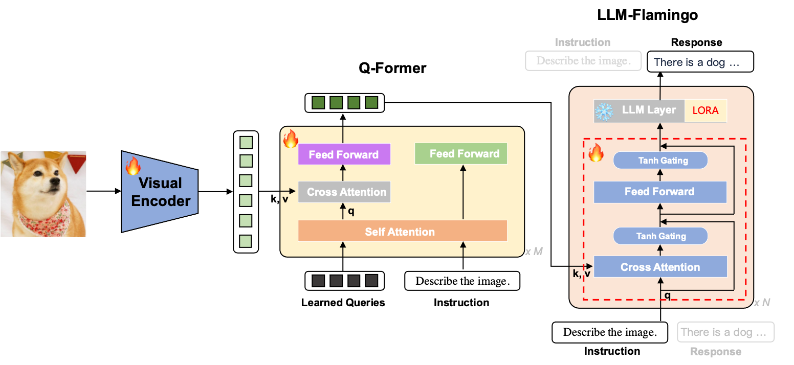
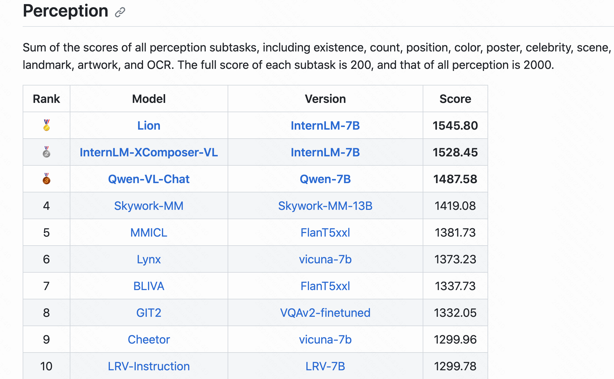
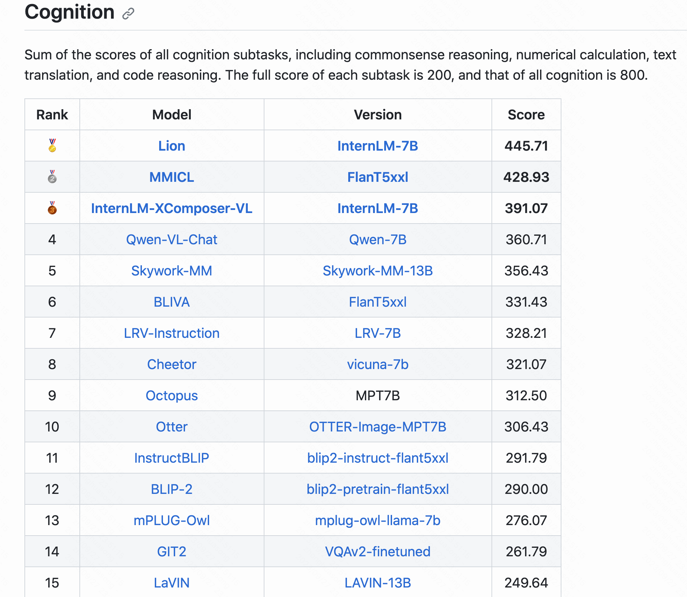

# Lion🦁️

**Lion**: Kind**li**ng Visi**on** Intelligence within Large Language Models. Codes and details will be released soon.

* Visual Encoder: ViT-G/14 from EVA-CLIP
* Q-Former:  ChineseBERT
* LLM:  InternLM 7B
* Flamingo:  Gating Cross Attention + FFN

**Demo**: <a href="https://06618c71fdf1f681c7.gradio.live">demo link</a> (Recommend using English for questioning)

### MME Benchmark
* [MME](https://github.com/BradyFU/Awesome-Multimodal-Large-Language-Models/tree/Evaluation),a comprehensive benchmark for multimodal large language models evaluation. MME evaluates perception and cognition abilities through 14 subtasks: existence, count, position, color, poster, celebrity, scene, landmark, artwork, OCR, commonsense reasoning, numerical calculation, text translation, and code reasoning. 

* We achieves SOTAs on **overall/perception/cognition** performance evaluation.

  

Overall Performance

| Rank |         Model         |    Version     |   Score    |
| :--: | :-------------------: | :------------: | :--------: |
|  1   |       **Ours**        |    **Ours**    | **1991.5** |
|  2   | InternLM-XComposer-VL |  InternLM-7B   |   1919.5   |
|  3   |     Qwen-VL-Chat      |    Qwen-7B     |   1848.3   |
|  4   |         MMICL         |   FlanT5xxl    |   1810.7   |
|  5   |      Skywork-MM       | Skywork-MM-13B |   1775.5   |

